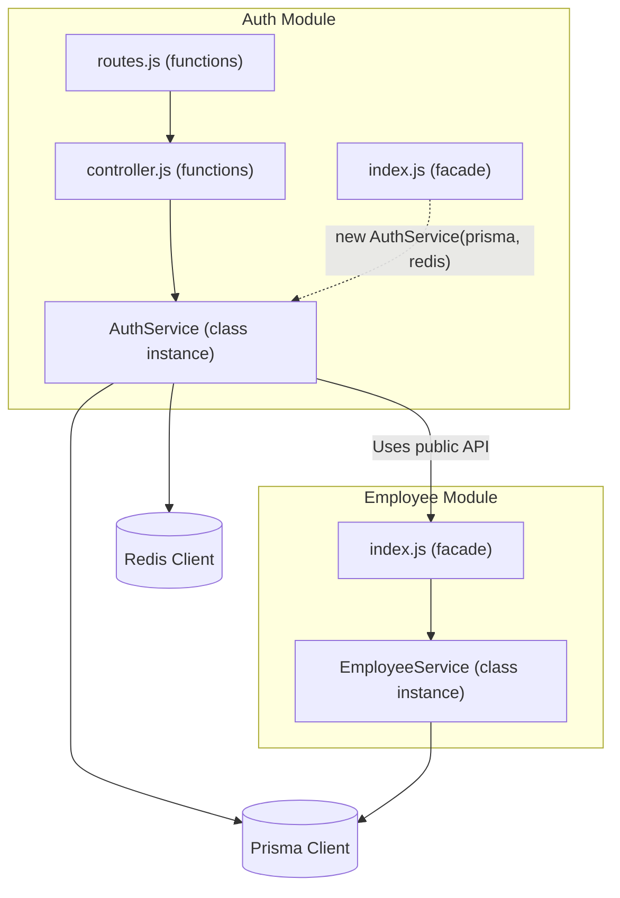
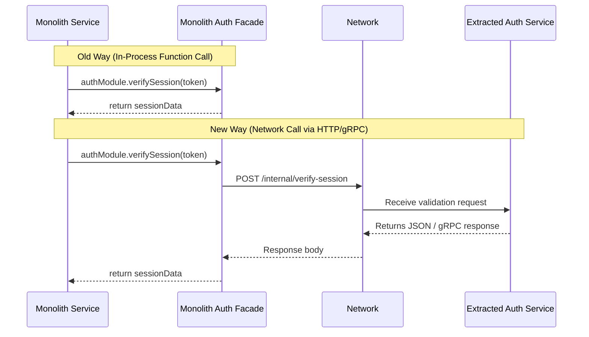

# HRMS Backend - Modular Monolith Architecture

This document describes the architectural design for the HRMS (Human Resource Management System) backend. The system is designed as a **Modular Monolith** using **Node.js, Express, Prisma, PostgreSQL, and Redis**. 

The target audience is mid-size companies (50–200 employees) with support for **multi-tenant SaaS**.

---

## 1. Directory Structure

Below is the complete directory structure for the modular monolith, including short descriptions of each file's responsibility.

```text
hrms-backend/
├── docs/
│   └── architecture.md            # [THIS FILE] System architectural overview and microservice migration plan
├── prisma/
│   ├── schema.prisma              # Database schema definition for PostgreSQL (tenants, users, employees, etc.)
│   └── migrations/                # Database migration logs
├── src/
│   ├── config/
│   │   ├── env.js                 # Validates and exports environment variables using Zod/Joi
│   │   ├── prisma.js              # Initializes and exports a single global Prisma Client instance
│   │   └── redis.js               # Configures and manages the Redis connection for caching/session store
│   ├── middleware/
│   │   ├── auth.middleware.js     # Authenticates incoming JWT tokens and injects session data
│   │   ├── error.middleware.js    # Global error handler capturing custom AppErrors and formatting standard JSON responses
│   │   ├── rate-limiter.middleware.js # Prevents brute force and denial of service attacks using Redis
│   │   └── tenant.middleware.js   # Extracts tenant identifier (e.g., header, subdomain) and binds it to request context
│   ├── utils/
│   │   ├── error.utils.js         # Custom exception classes (e.g., NotFoundError, BadRequestError)
│   │   └── response.utils.js      # Normalized standard API response utility (success, error, pagination)
│   ├── modules/
│   │   ├── auth/
│   │   │   ├── index.js           # Public module interface (facade) - the only allowed import for other modules
│   │   │   ├── routes.js          # Express route definitions for /api/v1/auth
│   │   │   ├── controller.js      # Parses requests, invokes auth services, and formats responses
│   │   │   ├── service.js         # Auth business logic (JWT issuance, password hashing, session caching)
│   │   │   └── validation.js      # Validation schemas (login, registration) using Zod/Joi
│   │   ├── employee/
│   │   │   ├── index.js           # Public interface for employee management tasks (e.g., verifying user-employee map)
│   │   │   ├── routes.js          # Express route definitions for /api/v1/employees
│   │   │   ├── controller.js      # Parses employee payload requests and invokes service methods
│   │   │   ├── service.js         # Employee business logic (onboarding, profiles, role management)
│   │   │   └── validation.js      # Input validation schemas for creating/updating employees
│   │   ├── attendance/
│   │   │   ├── index.js           # Public interface for attendance data (e.g., status checks for payroll/leave)
│   │   │   ├── routes.js          # Express route definitions for /api/v1/attendance
│   │   │   ├── controller.js      # Controller handling clock-in/out, geofencing coordinates checks
│   │   │   ├── service.js         # Attendance business logic (overtime calculation, shifts, clock-in logs)
│   │   │   └── validation.js      # Input validation schemas for clocking actions and log fetches
│   │   ├── leave/
│   │   │   ├── index.js           # Public interface for leave requests (e.g., query leave balances)
│   │   │   ├── routes.js          # Express route definitions for /api/v1/leaves
│   │   │   ├── controller.js      # Controller handling leave application submissions and approvals
│   │   │   ├── service.js         # Leave business logic (leave balance deductions, approval workflow, types)
│   │   │   └── validation.js      # Input validation schemas for leave requests and adjustments
│   │   └── notification/          # Stub module for alerts and notifications
│   │       ├── index.js           # Public facade to dispatch notifications (email/in-app) asynchronously
│   │       ├── routes.js          # Express route definitions for notification preferences and history
│   │       ├── controller.js      # Handles notification read receipts and preference updates
│   │       ├── service.js         # Stubbed notification dispatcher (will hook into WebSockets/Kafka later)
│   │       └── validation.js      # Validation schemas for notification preferences
│   ├── app.js                     # Express application configuration (middlewares, routes registration, CORS)
│   └── server.js                  # Entry point that runs DB checks, connects Redis, and starts the HTTP server
├── package.json                   # Node.js project manifest and dependency tracker
└── README.md                      # General instructions for building and running the project
```

---

## 2. Core Architectural Decisions

### Module Isolation & Communication Boundary
- **Independent Modules**: Each domain under `src/modules/` (e.g., `auth`, `employee`, `leave`) acts as a mini-application.
- **Strict Boundary (No Cross-Module Imports)**: Under no circumstance does a file in `src/modules/leave` directly import a file from `src/modules/employee` (e.g., `import EmployeeService from '../employee/service.js'` is strictly forbidden).
- **Module Facade Pattern (`index.js`)**: Communication between modules goes through the module's entry point (`index.js`). This file acts as a public facade. If the `leave` module needs to fetch employee details, it must import from `src/modules/employee/index.js`, which exposes a clean, stable Javascript API (e.g., `export const getEmployeeById = ...`).



### Layer Coding Conventions

> **Rule of thumb**: Classes live **only** in `service.js`. Everything else is plain exported functions.

| Layer | Style | Why |
|---|---|---|
| **Service** (`service.js`) | ES6 `class` | Encapsulates business logic + holds references to `prisma`, `redis`, and other module facades |
| **Controller** (`controller.js`) | Plain `async` functions | Thin glue — reads request, calls service, sends response |
| **Middleware** (`*.middleware.js`) | Plain functions | Stateless request pipeline steps |
| **Routes** (`routes.js`) | Plain `router.get/post/…` | Declarative route wiring |
| **Validation** (`validation.js`) | Plain schema exports | Stateless schema definitions (Zod / Joi) |

#### 1. Service Layer — Class-Based

Each module's business logic lives in a **single class** that receives its infrastructure dependencies through the constructor.

```javascript
// src/modules/auth/service.js
import bcrypt from 'bcrypt';
import jwt from 'jsonwebtoken';
import { env } from '../../config/env.js';
import { NotFoundError, UnauthorizedError } from '../../utils/error.utils.js';

class AuthService {
  constructor(prisma, redis) {
    this.prisma = prisma;
    this.redis = redis;
  }

  async login({ email, password }) {
    const user = await this.prisma.user.findUnique({ where: { email } });
    if (!user) throw new NotFoundError('User not found');

    const valid = await bcrypt.compare(password, user.password);
    if (!valid) throw new UnauthorizedError('Invalid credentials');

    const token = jwt.sign({ sub: user.id, tenantId: user.tenantId }, env.JWT_SECRET, {
      expiresIn: env.JWT_EXPIRES_IN,
    });

    await this.redis.set(`session:${user.id}`, token, 'EX', env.SESSION_TTL);
    return { token, user: { id: user.id, email: user.email } };
  }

  async logout(userId) {
    await this.redis.del(`session:${userId}`);
  }

  async verifySession(token) {
    const payload = jwt.verify(token, env.JWT_SECRET);
    const cached = await this.redis.get(`session:${payload.sub}`);
    if (cached !== token) throw new UnauthorizedError('Session expired');
    return payload;
  }
}

export default AuthService;
```

**Key points**:
- `this.prisma` and `this.redis` are the **only** ways the service touches infrastructure.
- The class is **not** instantiated inside this file — that happens in `index.js` (see below).
- Throws semantic errors (`NotFoundError`, `UnauthorizedError`) — never raw HTTP status codes.

#### 2. Controller Layer — Plain Functions

Controllers are thin. They destructure the request, call the service instance, and use `response.utils.js` to send a standardised reply.

```javascript
// src/modules/auth/controller.js
import { sendSuccess } from '../../utils/response.utils.js';
import { authService } from './index.js';

export const login = async (req, res, next) => {
  try {
    const result = await authService.login(req.body);
    sendSuccess(res, result, 'Login successful');
  } catch (err) {
    next(err); // Caught by error.middleware.js
  }
};

export const logout = async (req, res, next) => {
  try {
    await authService.logout(req.user.id);
    sendSuccess(res, null, 'Logged out');
  } catch (err) {
    next(err);
  }
};
```

**Rules**:
- **No** `new AuthService(...)` here — import the pre-built instance from `index.js`.
- **No** Prisma or Redis references.
- **No** business logic beyond "call service, return result".

#### 3. Middleware — Plain Functions

```javascript
// src/middleware/auth.middleware.js
import { authService } from '../modules/auth/index.js';
import { UnauthorizedError } from '../utils/error.utils.js';

export const authenticate = async (req, res, next) => {
  try {
    const token = req.headers.authorization?.split(' ')[1];
    if (!token) throw new UnauthorizedError('Token missing');
    req.user = await authService.verifySession(token);
    next();
  } catch (err) {
    next(err);
  }
};
```

Middleware is **always functional** — no classes, no constructor, no state.

#### 4. Module Facade (`index.js`) — Wiring Without a DI Framework

Each module's `index.js` is where the service class is **instantiated once** at import time with the real infrastructure singletons. There is **no dependency-injection container** — just plain manual wiring.

```javascript
// src/modules/auth/index.js
import AuthService from './service.js';
import prisma from '../../config/prisma.js';
import redis from '../../config/redis.js';

// Single instance — created once when the module is first imported
export const authService = new AuthService(prisma, redis);
```

This is the **only file other modules are allowed to import from**. For example, `src/modules/leave/service.js` can do:
```javascript
import { authService } from '../auth/index.js';
```
but must **never** import `../auth/service.js` or `../auth/controller.js` directly.

#### Why No DI Framework?

| Concern | Our Approach |
|---|---|
| Testability | Pass mock `prisma`/`redis` via constructor: `new AuthService(mockPrisma, mockRedis)` |
| Simplicity | One line in `index.js` — no container config, no decorators, no magic |
| Readability | Any developer can open `index.js` and see exactly what the service receives |
| Overhead | Zero runtime cost — no reflection, no proxy objects |

### Centralized Configuration Rule

> **Strict Rule**: Direct access to `process.env` anywhere outside `src/config/env.js` is strictly forbidden.

#### Why?
To support future roadmap progression (e.g. migrating configuration storage from local environment variables to secret managers like **Azure Key Vault** or **AWS Secrets Manager** in production), we decouple configuration sourcing from the business logic.

#### Usage Convention
All files requiring config access must import the validated configuration object:
```javascript
// ✅ Correct approach
import { env } from '../../config/env.js';
const secret = env.JWT_SECRET;

// ❌ Forbidden approach
const secret = process.env.JWT_SECRET;
```

---

## 3. Microservice Extraction Strategy (Auth Service Example)

Extracting the `auth` module into a standalone microservice later (Phase 3) is highly streamlined thanks to the modular monolith's strict module isolation. The transition is completed in a few clean steps without rewriting the core business logic.



### Step-by-Step Migration Guide

#### Step 1: Separate the Codebase
Copy the entire `src/modules/auth` folder along with configuration dependencies (`env.js`, `redis.js`, `prisma.js`, `response.utils.js`, `error.utils.js`) into a new Git repository. The directory structure will look like this:
```text
auth-service/
├── config/ (env, prisma, redis)
├── utils/ (error, response)
├── modules/
│   └── auth/ (routes, controller, service, validation)
├── app.js
└── server.js
```
The `AuthService` class in `service.js` remains **exactly the same**. Its constructor still receives `prisma` and `redis`; its methods still validate credentials, sign JWTs, and manage sessions. Zero business-logic rewrites.

#### Step 2: Update the Monolith's Auth Facade
In the monolith repository, we do **not** delete `src/modules/auth/index.js`. Instead, we rewrite it to act as a **client stub / gateway wrapper** that makes network calls instead of instantiating the class.

Before extraction (In-process — class instance):
```javascript
// src/modules/auth/index.js (Modular Monolith)
import AuthService from './service.js';
import prisma from '../../config/prisma.js';
import redis from '../../config/redis.js';

export const authService = new AuthService(prisma, redis);
```

After extraction (Distributed — HTTP client stub):
```javascript
// src/modules/auth/index.js (Monolith Wrapper)
import axios from 'axios';
import { env } from '../../config/env.js';

// Mimics the same public interface so consumers don't change
export const authService = {
  async login(body) {
    const res = await axios.post(`${env.AUTH_SERVICE_URL}/api/v1/auth/login`, body);
    return res.data.data;
  },
  async logout(userId) {
    await axios.post(`${env.AUTH_SERVICE_URL}/api/v1/auth/logout`, { userId });
  },
  async verifySession(token) {
    const res = await axios.post(
      `${env.AUTH_SERVICE_URL}/internal/verify-session`,
      {},
      { headers: { Authorization: `Bearer ${token}` } }
    );
    return res.data.data;
  },
};
```
Because every consumer (controllers, middleware, other modules) imports `authService` from `index.js`, **no other file in the monolith needs to change** — the public interface is identical.

#### Step 3: Database Decoupling
1. **Prisma Client Isolation**: Move auth-related tables (`User`, `Session`, `Role`, `Permission`) to a separate schema/database context managed exclusively by the new `auth-service`.
2. **Remove Tables from Monolith**: Delete the auth tables from the monolith's `schema.prisma` file. The monolith will keep track of authorization levels solely via JWT content (claims) or requests sent back to the `auth-service`.

#### Step 4: Routing & API Gateway
Update the API gateway or reverse proxy (e.g., Nginx, Kong, Traefik) to route traffic starting with `/api/v1/auth` to the new `auth-service` container, while routing other endpoints (e.g., `/api/v1/employees`) to the monolith.
