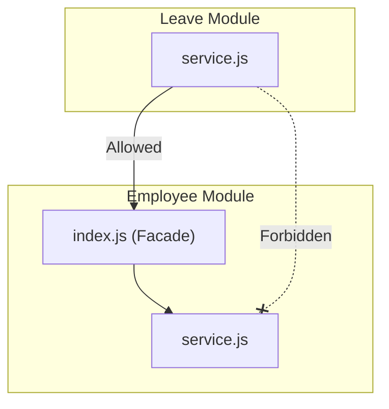

# HRMS Backend Coding Standards & Guidelines

This document outlines the coding standards, architectural patterns, and design guidelines for developers working on the HRMS Backend. Adherence to these standards is mandatory to ensure codebase maintainability, clean separation of concerns, and security.

---

## 1. Directory Structure & Modular Monolith Design

The backend is built as a **Modular Monolith**. Each domain logic area lives as an isolated unit under `src/modules/`.

```text
src/modules/module-name/
├── index.js          # Public facade (API boundary)
├── routes.js         # Endpoint declarations
├── controller.js     # Express request/response handlers
├── service.js        # Class containing business logic
└── validation.js     # Request payload validation schemas
```

---

## 2. Module Boundaries & Communication

### Rule of the Module Facade
* **Isolation**: Modules must act as independent units. Under no circumstances may a file in one module import internal details from another module.
* **Strict Boundary**: Imports across modules MUST go through the module's public facade (`index.js`).

#### ❌ Wrong (Forbidden Cross-Module Imports)
```javascript
// Inside src/modules/leave/service.js
import EmployeeService from '../employee/service.js'; // ❌ Direct class import
import { updateEmployeeSchema } from '../employee/validation.js'; // ❌ Direct helper import
```

#### ✅ Right (Correct Facade Import)
```javascript
// Inside src/modules/leave/service.js
import { employeeService } from '../employee/index.js'; // ✅ Import public facade instance
```



---

## 3. Layer Coding Conventions

Keep code structure clean and predictable across different layers.

| Layer | Architecture Style | Responsibility |
|---|---|---|
| **Service** (`service.js`) | ES6 `class` | Business rules, calculations, caching, and database queries. |
| **Controller** (`controller.js`) | Plain `async` functions | Gluing HTTP requests to services and returning standardized JSON. |
| **Middleware** (`*.middleware.js`) | Plain functions | Stateless request-response hook points. |
| **Routes** (`routes.js`) | Express router | Mapping route endpoints to controller functions. |
| **Validation** (`validation.js`) | Declarative schemas (Zod) | Validating payload structure and constraints. |

### A. Service Layer (Class-Based)
* Business logic must reside inside service classes.
* Do not instantiate infrastructure dependencies (like Prisma or Redis) inside the service. Pass them into the constructor (Dependency Injection).
* Services must throw semantic errors (`NotFoundError`, `BadRequestError`) rather than returning raw HTTP response objects.

```javascript
// ✅ Right: Class-based service with constructor injection
import { NotFoundError } from '../../utils/error.utils.js';

class EmployeeService {
  constructor(prisma, redis) {
    this.prisma = prisma;
    this.redis = redis;
  }

  async getEmployeeById(id) {
    const employee = await this.prisma.employee.findFirst({ where: { id } });
    if (!employee) throw new NotFoundError('Employee not found');
    return employee;
  }
}

export default EmployeeService;
```

### B. Controller Layer (Functional)
* Controllers must be thin, functional wrappers.
* Do not initialize service classes or make database queries directly in controllers. Import the pre-configured instance from the module facade.

```javascript
// ✅ Right: Thin controller calling facade instance
import { employeeService } from './index.js';
import { sendSuccess } from '../../utils/response.utils.js';

export const getEmployeeById = async (req, res, next) => {
  try {
    const result = await employeeService.getEmployeeById(req.params.id);
    sendSuccess(res, result, 'Employee retrieved successfully');
  } catch (error) {
    next(error); // Forward semantic errors to the global error middleware
  }
};
```

---

## 4. Centralized Configuration Rule

> **Strict Rule**: Direct access to `process.env` anywhere outside `src/config/env.js` is strictly forbidden.

### Rationale
Config variables must be validated at application startup using a strict schema (e.g. Zod). Accessing `process.env` directly throughout the codebase makes it difficult to track configuration dependencies and migrate to external vault tools (such as AWS Secrets Manager).

#### ❌ Wrong
```javascript
// Inside src/modules/auth/service.js
const token = jwt.sign(payload, process.env.JWT_SECRET); // ❌ Raw process.env access
```

#### ✅ Right
```javascript
// Inside src/modules/auth/service.js
import { env } from '../../config/env.js';

const token = jwt.sign(payload, env.JWT_SECRET); // ✅ Access validated config
```

---

## 5. Multi-Tenancy Scoping

Every query targeting data inside the shared schema must respect tenant isolation constraints.

* **Tenant Isolation**: Direct user queries should never expose or write data outside the active `tenantId`.
* **Automatic Scoping**: Multi-tenancy filtering is handled globally via Prisma Extensions. Developers do not need to manually append `where: { tenantId }` checks for standard operations.
* **Avoid findUnique**: `findUnique` does not accept generic properties like `tenantId` in its filter schema, which allows query execution to bypass row-level checks. **Always use `findFirst` instead of `findUnique`** to ensure the query extension intercepts and scopes the query correctly.

---

## 6. Error & Response Standardization

### Success Responses
Always use the standardized success response utility:
```javascript
import { sendSuccess } from '../../utils/response.utils.js';
sendSuccess(res, data, 'Success message', 200);
```

### Error Handling
* Do not return HTTP responses manually inside business logic handlers. Throw custom exceptions that extend `AppError`.
* The centralized error middleware will catch these exceptions, map them to standard formats, and hide database details in production.

Available exceptions under `src/utils/error.utils.js`:
* `BadRequestError(message)` -> 400
* `UnauthorizedError(message)` -> 401
* `ForbiddenError(message)` -> 403
* `NotFoundError(message)` -> 404
* `AppError(message, statusCode)` -> Custom Code
